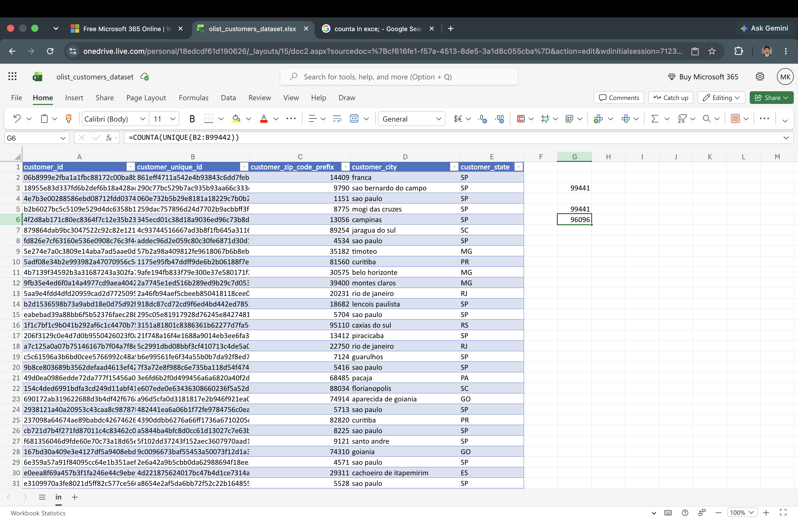
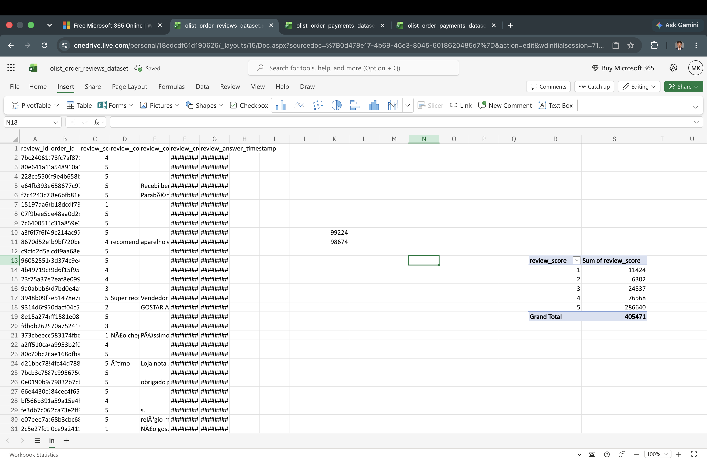
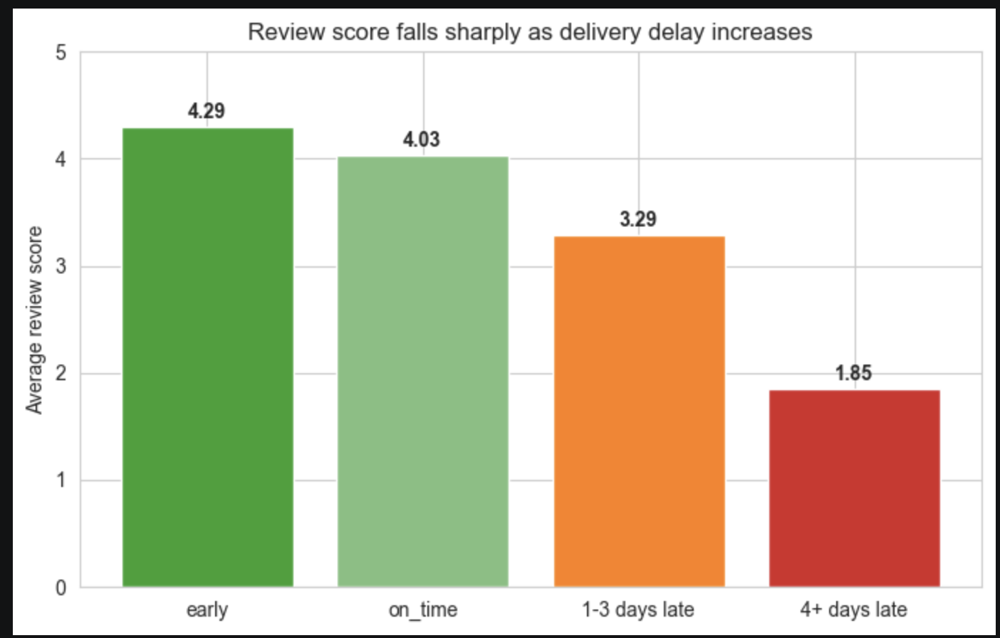
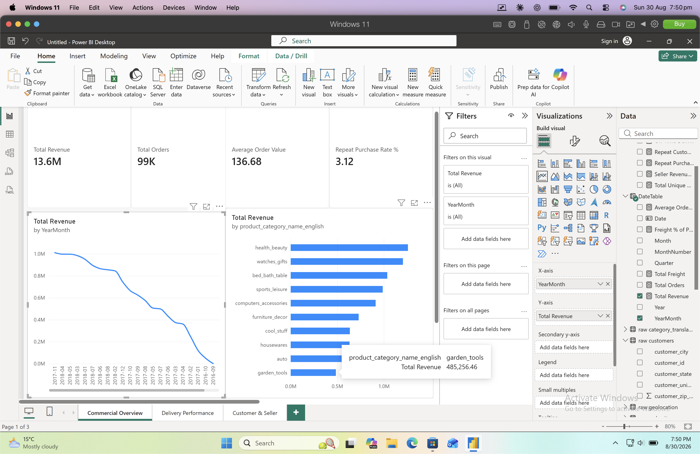
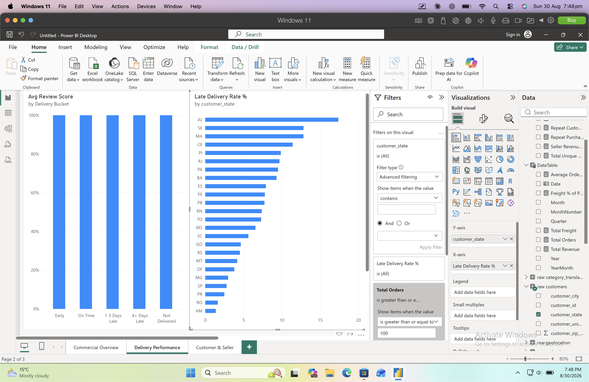
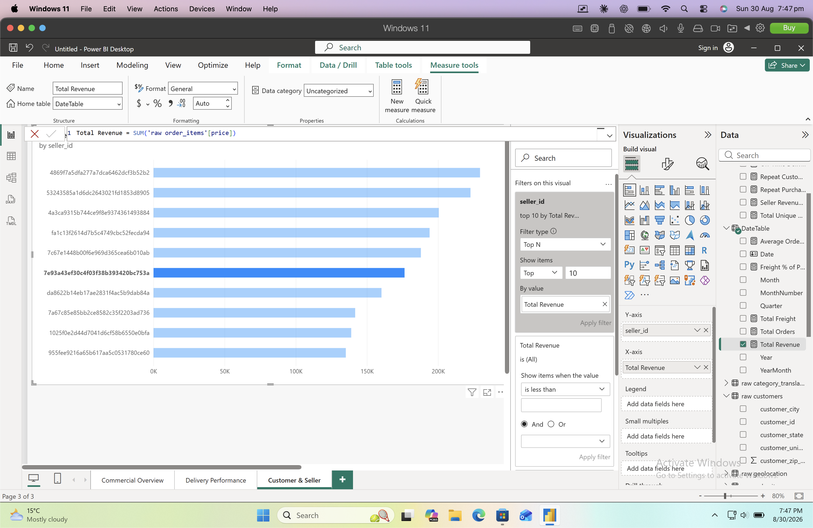

# E-Commerce Delivery & Retention Review

End-to-end analysis of a 100K-order online marketplace (the
[Olist Brazilian E-Commerce dataset](https://www.kaggle.com/datasets/olistbr/brazilian-ecommerce),
9 relational tables), taken from a raw Excel first look through Python, PostgreSQL and a
Power BI dashboard — $13.6M in revenue, 99K orders, 3,095 sellers, 71 categories.

## The brief

I'm the first data analyst hired by this marketplace. Leadership has two open questions
and no analytics function to draw on yet:

1. **Why aren't customers coming back?**
2. **Is delivery performance actually costing us anything — or is that just a hunch?**

Full framing in [`docs/business_brief.md`](docs/business_brief.md).

## Headline findings

| # | Question | Finding |
|---|---|---|
| 1 | Revenue concentration | Top 10 of 71 categories drive **62.4%** of revenue |
| 2 | Delivery vs. satisfaction | Review score falls from **4.29** (early) to **1.85** (4+ days late) — the strongest satisfaction driver in the data |
| 3 | Repeat purchase rate | Only **3.12%** of customers (2,997 of 96,096) order more than once |
| 4 | Seller concentration | Top 10% of sellers (310 of 3,095) generate **67.6%** of revenue |
| 5 | Freight cost by category | Aggregate freight is **16.6%** of item price; `electronics` carries **29.1%** on real volume |
| 6 | Delivery by geography | National late rate **4.8%**; `AL` runs at **17.4%**, 3.5x the national rate |

**The connected story:** delivery lateness (finding 2) is concentrated in a handful of
states (finding 6), and the marketplace's 3% repeat-purchase rate (finding 3) is low
enough that poor delivery experience is a plausible contributing cause — not proven
here, but a real pattern leadership hadn't seen laid out side by side before.

Full write-up with supporting numbers: [`docs/findings.md`](docs/findings.md).

### Two self-caught methodology corrections

Every pandas result was independently reproduced in SQL before being treated as final.
Four of six matched exactly — two didn't, and both were caught and corrected before
reaching a dashboard:

- **Revenue concentration (Q1):** pandas' default `groupby()` silently drops rows with
  a null grouping key, excluding 1,627 order_items rows ($185K) with no matched category
  from the revenue total. That inflated the top-10 share to 63.2%. The SQL version uses
  a `LEFT JOIN` to keep those rows in the denominator — correct figure: **62.4%**.
- **Freight ratio (Q5):** the Excel first-look estimate (~22.6%) was a naive ratio of
  two column sums taken in isolation. The corrected method sums freight and price per
  category first, weighted by actual item volume — true aggregate: **16.6%**.

Root cause and resolution for both: [`docs/decisions_log.md`](docs/decisions_log.md).

## Why four tools, not one

The toolset wasn't chosen up front — each stage exists because the previous one hit a
real limit.

**Excel first look** ([`01_excel/`](01_excel/)) — profiled all 9 raw tables (row counts,
key uniqueness, obvious quality issues) before writing any code. This is where the
`customer_id` vs. `customer_unique_id` distinction, the ~3% non-delivery rate, and the
~22.6% naive freight ratio first surfaced.

→ **Moved to Python** because Excel hit three real ceilings: no clean way to join
multiple tables at 100K+ rows, no auditable record of how a number was derived (a pivot
table gives an answer but not a trail), and no transformation layer for the cleaning
this analysis needed. Reasoning in
[`01_excel/first_look_notes.md`](01_excel/first_look_notes.md#why-this-moves-beyond-excel).

**Python profiling & EDA** ([`02_python/`](02_python/)) — `01_profiling.ipynb`
quantified what Excel surfaced (null patterns across every column at once, the
`review_id` duplicate-key problem) and `02_eda_findings.ipynb` answered all six business
questions in pandas, with the freight-ratio methodology fix.

→ **Moved to SQL** for two reasons: independent reproduction of every pandas result to
catch exactly the kind of silent error `groupby()` produced in Q1, and because the
Power BI dashboard needed a proper relational source rather than 9 loose CSVs —
`02_python/src/load_to_postgres.py` loads the raw tables into Postgres, typed correctly,
so the business-question queries and the dashboard's data model both work from the same
relational source.

**SQL** ([`03_sql/`](03_sql/)) — all six questions reproduced independently
(`03_sql/analysis/`), plus row-count and cross-tool QA checks (`03_sql/qa/`). Four
questions matched pandas exactly; two didn't, and SQL's numbers are authoritative for
the reasons above.

**Power BI** ([`04_powerbi/`](04_powerbi/)) — a 3-page dashboard (Commercial Overview,
Delivery Performance, Customer & Seller) built directly on the same Postgres `raw`
schema, with every measure checked against its Python and SQL equivalent before being
added to a page. Model and measures documented in
[`data_model.md`](04_powerbi/data_model.md) and [`dax_measures.md`](04_powerbi/dax_measures.md).

## Repo structure

```
01_excel/          First-look profiling notes (pre-code)
02_python/
  notebooks/       01_profiling.ipynb, 02_eda_findings.ipynb
  src/             load_data.py, db.py, load_to_postgres.py
  outputs/         profiling_summary.csv, figures/
03_sql/
  ddl/             Table creation (explicit typing for raw.orders)
  qa/              Row-count checks, cross-tool validation summary
  analysis/        q1..q6 — one query per business question
04_powerbi/        ecommerce_review.pbix, dax_measures.md, data_model.md
docs/              business_brief.md, data_dictionary.md, findings.md, decisions_log.md
data/raw/          9 source CSVs (gitignored — see data/raw/README.md to fetch)
screenshots/       Proof-of-work screenshots per stage
```

## How to reproduce

1. **Get the data.** Download the 9 CSVs from
   [Kaggle](https://www.kaggle.com/datasets/olistbr/brazilian-ecommerce) into
   `data/raw/` — see [`data/raw/README.md`](data/raw/README.md) for exact filenames.
2. **Install dependencies:**
   ```bash
   pip install -r requirements.txt
   ```
3. **Set up Postgres.** Create a database, then add a `.env` file at the project root:
   ```
   DB_USER=...
   DB_PASSWORD=...
   DB_HOST=localhost
   DB_PORT=5432
   DB_NAME=ecommerce_review
   ```
4. **Load the raw tables:**
   ```bash
   cd 02_python/src
   python -m load_to_postgres
   ```
5. **Run the DDL and business queries** in `03_sql/ddl/` then `03_sql/analysis/` against
   the same database.
6. **Run the notebooks** in `02_python/notebooks/` (profiling first, then EDA) to
   reproduce the pandas side.
7. **Power BI:** open `04_powerbi/ecommerce_review.pbix` in Power BI Desktop and point
   it at the same Postgres database to refresh the model.

## Screenshots

**Excel first look** — catching the customer-key distinction and a review-score bug
before any code was written:




**Python EDA** — the headline chart, delivery delay vs. review score:



**Power BI dashboard** — three pages, each built on the same Postgres source as the SQL layer:





More stage-by-stage screenshots in [`screenshots/`](screenshots/).
